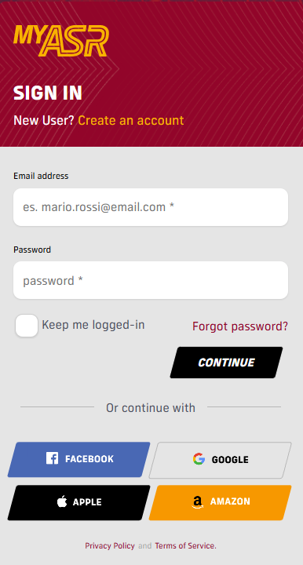
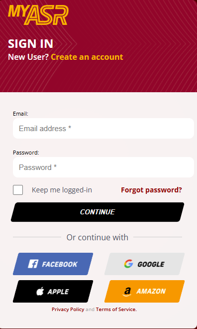

<h1 align="center">Replica of As Roma website</h1>

Replica of As Roma's sign-in and sign-up website. Includes sign-in and sign-up validation with SweetAlert2 pop-ups.

# Features
## 1. Login works only with:
Email: test@test.test  
Password: test

## 2. Full validation system:
Missing fields  
Invalid email format  
Wrong password

## 3. Modern design

## 4. SweetAlert2 pop-ups:
Error  
Success

## 5. Technologies used:
Html  
Css  
JavaScript  
SweetAlert2  
Google Fonts  
Custom images and icons  

# Author
Tadej Humar  
2024/25
# Photos

<table>
  <tr>
    <td align="center"><strong>Inspiration</strong></td>
    <td align="center"><strong>My Design</strong></td>
  </tr>
  <tr>
    <td align="center"></td>
    <td align="center"></td>
  </tr>
</table>
